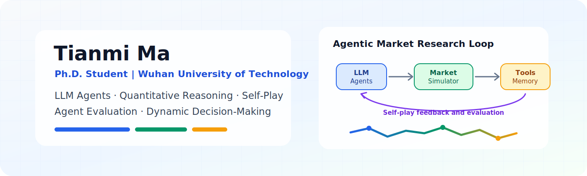
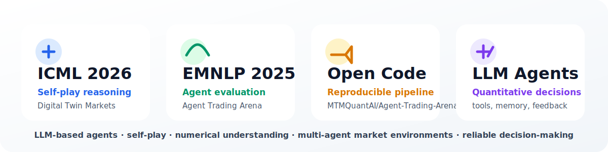
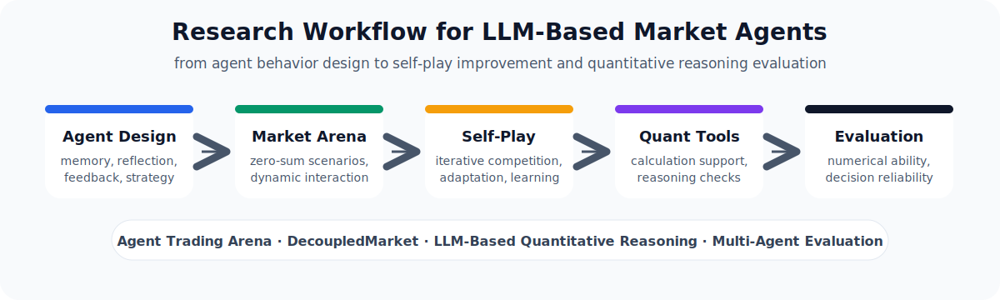
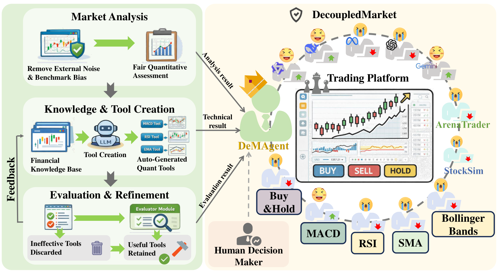
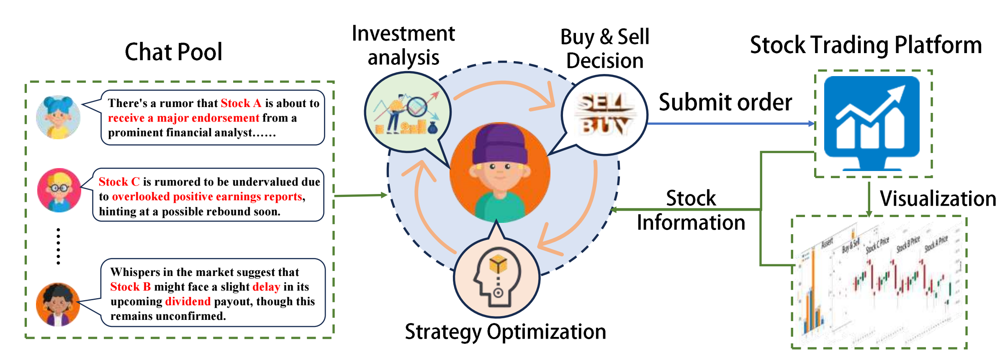

 

# Tianmi Ma

Ph.D. Student at Wuhan University of Technology  
Large Language Model Agents | Quantitative Reasoning | Self-Play | LLM Evaluation

 

## Profile Snapshot

 
 

## About Me

I am a Ph.D. student in the School of Computer Science and Artificial Intelligence at Wuhan University of Technology. My research focuses on large language model agents, quantitative reasoning, self-play, and evaluation of agentic decision-making systems.

I am particularly interested in building evaluation environments and learning frameworks where LLM-based agents can reason, compete, adapt, and improve through interaction.

## Current Focus

- Building controllable market environments for LLM-based agent evaluation
- Studying self-play mechanisms that improve quantitative reasoning and strategic decision-making
- Designing reproducible experiments for multi-agent interaction, tool use, and dynamic feedback

## Research Interests

- Large Language Model Agents
- Quantitative Reasoning and Numerical Understanding
- Self-Play and Multi-Agent Interaction
- Agent Evaluation and Benchmark Construction
- Reliable Decision-Making in Dynamic Environments

## Research Toolkit

## Research System

## Paper Frameworks

<b>Digital Twin Markets / DecoupledMarket</b>: self-play framework for evolving quantitative reasoning in LLM-based market agents.

 
 

<b>Agent Trading Arena</b>: controllable market arena for evaluating numerical understanding and decision-making in LLM-based agents.

## Selected Publications

- **Evolving Quantitative Reasoning through Self-Play in Digital Twin Markets**  
  Tianmi Ma, Wenxin Huang, Jiawei Du, Lin Li, Xian Zhong, Joey Tianyi Zhou  
  *ICML 2026, CCF-A, accepted*  
  [[Code]](https://github.com/MTMQuantAI/Agent-Trading-Arena/tree/main/decoupledmarket)

- **Agent Trading Arena: A Study on Numerical Understanding in LLM-Based Agents**  
  Tianmi Ma*, Jiawei Du*, Wenxin Huang, Wenjie Wang, Liang Xie, Xian Zhong, Joey Tianyi Zhou  
  *Findings of EMNLP 2025, CCF-B*  
  [[Code]](https://github.com/MTMQuantAI/Agent-Trading-Arena/tree/main/Agent-Trading-Arena)

## Featured Repository

**Agent-Trading-Arena** is an open-source research repository for LLM-based trading agents, numerical understanding, and self-play in controllable market environments. It includes code for both **Agent Trading Arena** and **DecoupledMarket**, connecting my EMNLP 2025 and ICML 2026 research lines.

The repository provides reproducible simulation workflows for multi-agent market experiments, including configurable agent architectures, memory/reflection/feedback mechanisms, self-play settings, tool-assisted quantitative reasoning, and performance analysis.

## Projects

### Digital Twin Markets

A self-play research framework for studying quantitative reasoning in dynamic market environments. This project explores how LLM-based agents can improve numerical reasoning, strategic planning, and adaptive decision-making through iterative interaction.

**Keywords:** self-play, quantitative reasoning, digital twin markets, agent learning  
**Code:** [MTMQuantAI/Agent-Trading-Arena/decoupledmarket](https://github.com/MTMQuantAI/Agent-Trading-Arena/tree/main/decoupledmarket)

### Agent Trading Arena

An evaluation platform for analyzing numerical understanding and decision-making ability of LLM-based agents in virtual zero-sum market scenarios. The platform supports systematic comparison across models, agent architectures, and experimental settings.

**Keywords:** LLM agents, numerical understanding, evaluation platform, multi-agent interaction  
**Code:** [MTMQuantAI/Agent-Trading-Arena/Agent-Trading-Arena](https://github.com/MTMQuantAI/Agent-Trading-Arena/tree/main/Agent-Trading-Arena)

## Academic Outputs

- First-author ICML 2026 paper on self-play and quantitative reasoning
- Co-first-author Findings of EMNLP 2025 paper on LLM-based agent evaluation
- Open-source research code for LLM agent trading environments: [Agent-Trading-Arena](https://github.com/MTMQuantAI/Agent-Trading-Arena)
- Chinese invention patent: closed-loop simulation method and apparatus for multimodal language models, Application No. 202610288525.2

## Honors and Awards

- National First Prize, AI Vision Application Track, RAICOM Robot Developer Competition, 2025
- Campus Second Prize, China Graduate FinTech Innovation Competition, 2025
- International First Prize, Mathematical Contest in Modeling, 2022
- First Prize in Hubei Province, China Undergraduate Mathematical Contest in Modeling, 2022
- National Encouragement Scholarship, 2021-2022

## Skills

**Research:** LLM agents, multi-agent evaluation, quantitative reasoning, experimental design, statistical analysis  
**Engineering:** Python, PyTorch, Git, data pipelines, automated experiments, result analysis  
**Writing:** academic paper writing, technical documentation, research proposal preparation

## Contact

- Email: [matianmi@whut.edu.cn](mailto:matianmi@whut.edu.cn)
- GitHub: [github.com/MTMQuantAI](https://github.com/MTMQuantAI)
- Research Code: [github.com/MTMQuantAI/Agent-Trading-Arena](https://github.com/MTMQuantAI/Agent-Trading-Arena)

---

Researching how language agents reason, interact, and improve in complex decision-making environments.

